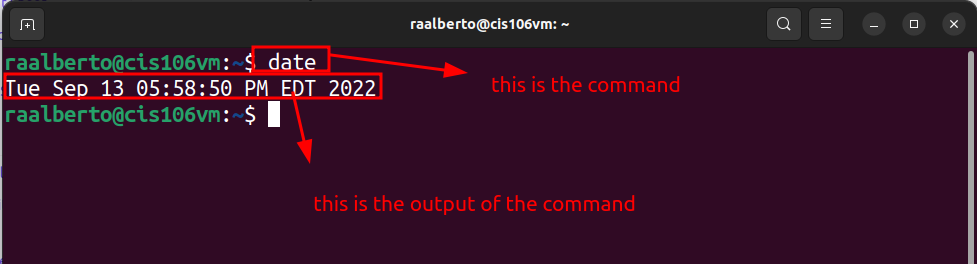
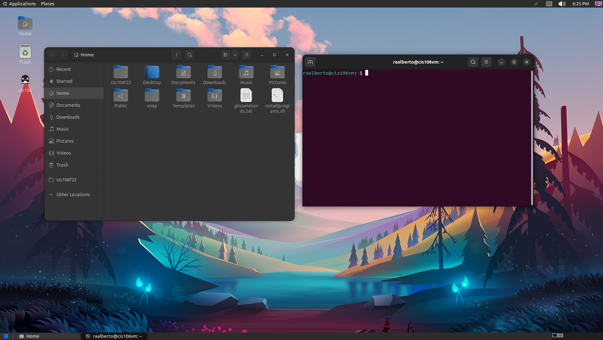

# Lab 3 Submission

## Question
Has no submission

## Question 2

## Question 3

| Program purpose     | Package Name     | Version                 |
| ------------------- | ---------------- | ----------------------- |
| Play a tetris game  | blockattack      | 2.7.0-1 amd64           |
| Play a video file   | dragonplatyer    | 4:21.12.3-0ubuntu amd64 |
| Browse the internet | epiphany-browser | 42.4-0ubuntu1 amd64     |
| Read your email     |                  |                         |
| Play music          |                  |                         |

1. Which command did you use to install?

2. Which command did you use to remove?

3. Which command will you use to install and remove?

## Question 4
| command | what it does            |
| ------- | ----------------------- |
| echo    | displays a line of text |
| fortune |                         |
| cowsay  |                         |
| lolcat  |                         |
| figlet  |                         |
| toilet  |                         |
| rig     |                         |