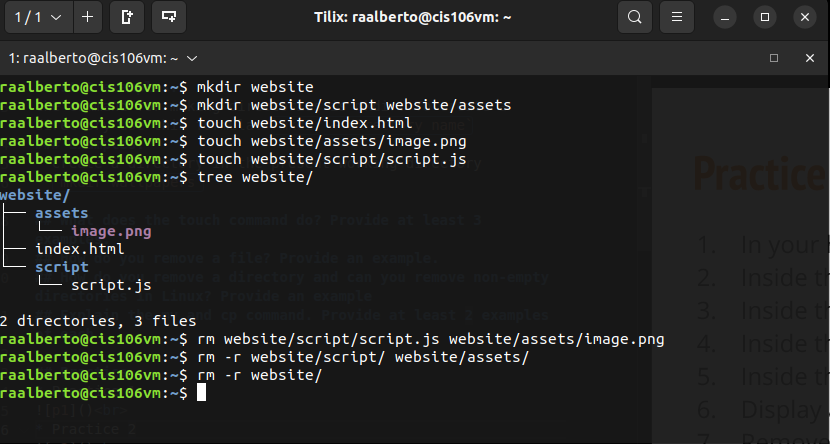

# Week Report 5
## What are Command Options?
answer here
## What are Command Arguments?
answer here
## Which command is used for creating directories? Provide at least 3 examples.
the command for making directories is mkdir. To create a directory use this formula: `mkdir + directory name`
### Examples:
* Create a directory in the present working directory
* `mkdir wallpapers`

## What does the touch command do? Provide at least 3 examples.
## How do you remove a file? Provide an example.
## How do you remove a directory and can you remove non-empty directories in Linux? Provide an example
## Explain the mv and cp command. Provide at least 2 examples of each

## Practice
* Practice 1
 
* Practice 2
 
* Practice 3
 
* Practice 4
 

