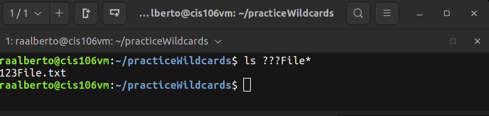

# Week Report  6

## Wildcards.

### * Wildcard
the * wildcard matches from 0 to any number of characters.
* Examples:
  * List all the text file in a directory
    * `ls *.txt`
  * List all the files that start with the word file
    * `ls file*`
  * Copy all the mp4 files
  * `cp Downloads/*.mp4 ~/Videos/Movies/`

### ? Wildcard
The ? wildcard matches a single character.
* Examples:
  * list all the files that have 3 characters and are followed by th word file in the name

### [] wildcard

### Brace Expansion

## Practice
