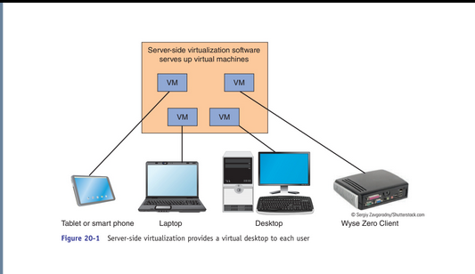
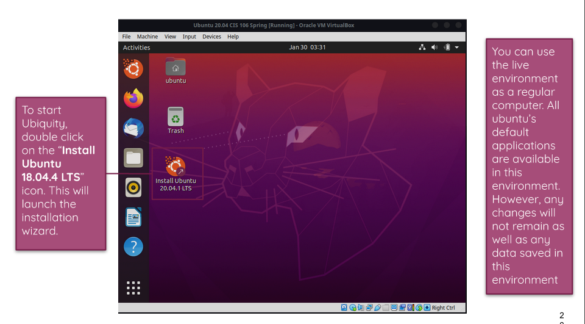

# Week Report 2 

##  The basics of virtualization

1. **What is virtualization**
Definition of virtualization

2. **Types of virtualization**

Server Side Virtualization
Definition:

## Installing Ubuntu in Virtualbox 
* Ubuntu live session

