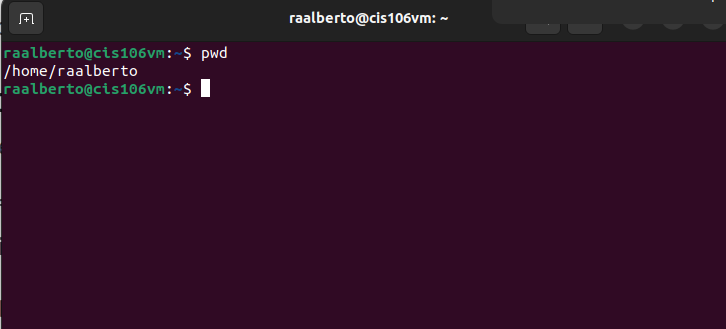
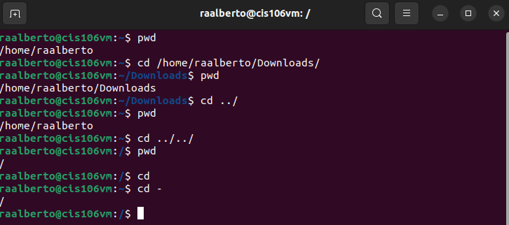

# Week Report 4

## Practice

## The Filesystem (Some important Directories)

| Directory | Data Stored in Directory |
| --------- | ------------------------ |
| bin       | essential commands       |
| dev       | device files             |
| etc       | ----                     |
| home      | ---                      |
| media     | ---                      |
| opt       | ---                      |
| proc      | ---                      |
| srv       | ---                      |
| usr       | ---                      |
| var       | ---                      |

## Commands to navigate the filesystem

| command | What it does                     | Syntax | Example |
| ------- | -------------------------------- | ------ | ------- |
| pwd     | prints current working directory | `pwd`  | `pwd`   |

## Key terms

*Definitions of the following terms*

* **File system:** definition goes here
* Current directory: 
* parent directory: 
* the difference between your home directory and the home directory
  * 
* pathname
* relative path
* absolute path
* The commands are used for navigating the filesystem
  * pwd 
  * cd
  * ls
